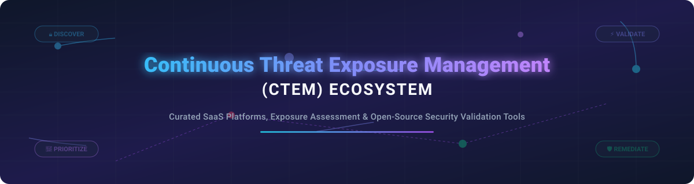

  

# 🛡️ Awesome Continuous Threat Exposure Management (CTEM)

A curated directory of SaaS platforms, breach and attack simulation (BAS) tools, exposure assessment solutions, and open-source security projects for **Continuous Threat Exposure Management (CTEM)**.

---

## 📑 Table of Contents
- [📌 Overview](#-overview)
- [🏢 SaaS & Commercial Platforms](#-saas--commercial-platforms)
- [🔓 Open-Source Projects](#-open-source-projects)
- [🤝 How to Contribute](#-how-to-contribute)
- [💖 Support & Sponsorship](#-support--sponsorship)
- [📈 Star History](#-star-history)
- [⚠️ Disclaimer](#%EF%B8%8F-disclaimer)

---

## 📌 Overview

**Continuous Threat Exposure Management (CTEM)** is a security framework introduced by Gartner that enables organizations to continuously evaluate, validate, and prioritize vulnerabilities, attack paths, and digital asset exposures. Rather than relying solely on periodic vulnerability scans, CTEM integrates **Attack Surface Management (ASM)**, **Breach & Attack Simulation (BAS)**, and **Risk-Based Vulnerability Management (RBVM)** into a threat-informed remediation lifecycle.

---

## 🏢 SaaS & Commercial Platforms

> 📊 **Market Insights**: The global Exposure Management and CTEM software market size is estimated at **$4.2 Billion** and is projected to reach **$12.8 Billion by 2030**. The sector is currently **moderately fragmented**, undergoing active consolidation as enterprise leaders acquire specialized attack path analysis and breach simulation vendors.

| Platform | Description | Size (Revenue / Valuation) | Starting Pricing | Free Tier / Trial Limit |
| :--- | :--- | :--- | :--- | :--- |
| **[Palo Alto Networks Exposure Management](https://www.paloaltonetworks.com/)** | Exposure management integrated into Cortex XPANSE & Prisma Cloud for attack surface visibility. | ~$11.48B Rev / $312B MCap | Enterprise quote-based (~$3,600/yr starting per module) | 30-Day Free Trial (Prisma Cloud / Cortex XDR) |
| **[Qualys Enterprise TruRisk](https://www.qualys.com/)** | Enterprise TruRisk Management (ETM) platform with risk scoring and KEV early warning. | ~$598M Rev / $5.2B MCap | Starts at $3,500/year for VMDR base tier | 30-Day Unlimited Asset Free Trial |
| **[Tenable One / ExposureAI](https://www.tenable.com/)** | AI-powered exposure management platform consolidating IT, Cloud, OT, and identity exposure. | ~$875M Rev / $4.8B MCap | Starts at $3,750/year (Tenable VM / Tenable One quote) | 30-Day Free Trial (Tenable VM / Nessus Pro) |
| **[Rapid7 Exposure Command](https://www.rapid7.com/)** | Unified attack surface visibility with eBPF runtime validation and automated Remediation Hub. | ~$820M Rev / $2.4B MCap | Starts at $4,000/year for InsightVM base | 30-Day Free Trial for Insight Platform |
| **[XM Cyber](https://xmcyber.com/)** | Continuous threat exposure management platform specializing in graph-based attack path analysis. | Acquired by Schwarz Group for $700M | Enterprise quote-based (~$25,000/yr minimum) | Custom Proof-of-Concept (14-day guided trial) |
| **[SafeBreach](https://www.safebreach.com/)** | Continuous security validation and Breach & Attack Simulation across the MITRE ATT&CK kill chain. | ~$150M Valuation (Series D) | Enterprise quote-based (~$18,000/yr starting) | 14-Day Guided Proof-of-Concept Trial |
| **[AttackIQ](https://www.attackiq.com/)** | Breach & attack simulation platform continuously testing security controls against adversary TTPs. | ~$120M Valuation | Enterprise quote-based (~$15,000/yr starting) | Free AttackIQ Academy (No free software tier) |
| **[Cymulate](https://cymulate.com/)** | Automated breach and attack simulation platform validating security control posture. | ~$100M Valuation (Series D) | Enterprise quote-based (~$12,000/yr starting) | 14-Day Free Trial (Limited simulation scenarios) |
| **[Picus Security](https://www.picussecurity.com/)** | Security control validation platform integrating threat exposure management with BAS capabilities. | ~$80M Valuation (Series B) | Enterprise quote-based (~$10,000/yr starting) | 14-Day Free Trial (Simulate top 10 cyber threats) |
| **[Kenna Security (Cisco)](https://www.kennasecurity.com/)** | Risk-based vulnerability prioritization engine powered by real-time exploit intelligence. | Acquired by Cisco for ~$500M | Enterprise quote-based (~$5,000/yr starting) | Guided Demo / Proof-of-Concept (No self-serve trial) |

---

## 🔓 Open-Source Projects

The open-source CTEM ecosystem provides foundational building blocks for breach simulation, vulnerability prioritization, threat intelligence enrichment, and attack surface discovery.

| Repository / Project | Description | GitHub Stars |
| :--- | :--- | :--- |
| **[Trivy](https://github.com/aquasecurity/trivy)** | Comprehensive security scanner for container images, file systems, Git repositories, and cloud configurations. |  |
| **[Grype](https://github.com/anchore/grype)** | Vulnerability scanner for container images and filesystems, ideal for CI/CD exposure checks. |  |
| **[OpenCTI](https://github.com/OpenCTI-Platform/opencti)** | Open-source threat intelligence platform structuring operational, tactical, and strategic threat data. |  |
| **[Caldera](https://github.com/mitre/caldera)** | MITRE's automated adversary emulation and breach simulation platform for purple team exercises. |  |
| **[DefectDojo](https://github.com/DefectDojo/django-DefectDojo)** | DevSecOps orchestrator and vulnerability management platform for aggregating scanner findings. |  |
| **[OpenBAS](https://github.com/OpenBAS-Platform/openbas)** | Leading open-source Breach and Attack Simulation platform for exercise management. |  |
| **[OpenAEV](https://github.com/OpenAEV-Platform/openaev)** | Open-source adversarial exposure validation and attack simulation suite from Filigran. |  |
| **[OpenASM](https://github.com/oasm-platform/open-asm)** | AI-powered open-source Attack Surface Management platform with Model Context Protocol (MCP) support. |  |
| **[ExposureNexus](https://github.com/s-schoen/exposurenexus)** | Dedicated open-source CTEM platform importing Nuclei findings with asset-centric triage workflows. |  |
| **[VMC (OWASP)](https://github.com/DSecureMe/vmc-docker)** | OWASP Vulnerability Management Center for asset-aware CVSS environmental scoring and TheHive integration. |  |

---

## 🤝 How to Contribute

Contributions are welcome! To add a SaaS product or open-source CTEM tool:
1. 🍴 Fork this repository.
2. 📝 Add your entry to `README.md` adhering to the tabular structure and formatting rules.
3. 🚀 Create a Pull Request with a clear description of the project.

---

## 💖 Support & Sponsorship

If you find this CTEM reference list helpful, please consider supporting the maintenance and growth of this project:

- 🌟 **Star** this repository on GitHub.
- 🔀 **Fork** and share it with fellow security engineers and SOC analysts.
- ☕ **Buy me a coffee**: Support ongoing work via the [GitHub Sponsor Dashboard](https://github.com/sponsors/ishandutta2007).

Thank you for helping build a more transparent and accessible cyber security ecosystem! 🚀

---

## 📈 Star History

---

## ⚠️ Disclaimer

- This list is **community-curated** for educational and research purposes.
- Product details, pricing, and company metrics are updated periodically based on public filings and vendor information.
